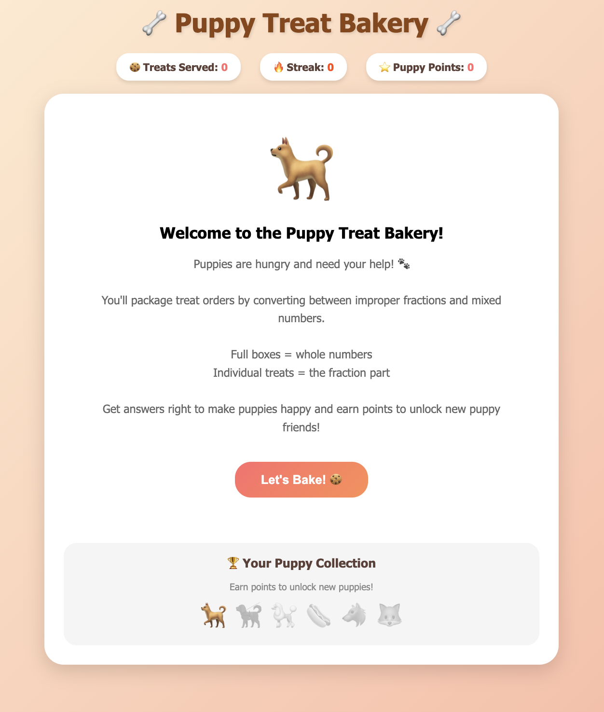

# 🐕 Puppy Treat Bakery

A fun, interactive math game for kids to practice converting between improper fractions and mixed numbers.

**[Play the game here!](https://linonu.github.io/puppy-treat-bakery/)**

## About

In Puppy Treat Bakery, players run a bakery that makes treats for puppies. Fractions represent batches of treats, and players must convert between improper fractions and mixed numbers to correctly package orders for adorable puppy customers.

The visual metaphor makes fractions intuitive:
- **Full boxes** = whole numbers
- **Individual treats** = the fractional part

## Features

- 🔄 **Three game modes:**
  - Improper → Mixed (e.g., 7/3 → 2⅓)
  - Mixed → Improper (e.g., 2½ → 5/2)
  - Mix It Up! (random problems)

- 📊 **Three difficulty levels:**
  - Easy (small numbers, denominators 2-4)
  - Medium (moderate numbers, denominators 2-6)
  - Hard (larger numbers, denominators 3-10)

- 💡 **Visual hints** showing treats in boxes to help understand the conversion

- 🎮 **Gamification elements:**
  - Score tracking
  - Streak bonuses for consecutive correct answers
  - Puppy Points system
  - Unlock new puppy characters as you earn points

- 🎉 **Fun feedback:**
  - Animated puppies that celebrate or encourage
  - Confetti for correct answers
  - Silly puppy sayings

## How to Play

1. A puppy appears with a treat order shown as a fraction
2. Convert the fraction:
   - For improper fractions: enter the whole number and remaining fraction
   - For mixed numbers: enter the improper fraction
3. Click "Serve Treats!" or press Enter to submit
4. Earn points and unlock new puppies!

**Tip:** Use the "Show Hint" button to see a visual representation of the treats in boxes.

## Unlockable Puppies

| Points | Puppy |
|--------|-------|
| 0 | 🐕 Starter Pup |
| 50 | 🐕‍🦺 Service Dog |
| 100 | 🐩 Poodle |
| 200 | 🌭 Hot Dog |
| 350 | 🐺 Wolf |
| 500 | 🦊 Fox |

## Technical Details

- Pure HTML, CSS, and JavaScript (no dependencies)
- Responsive design works on desktop and mobile
- No data collection or external requests
- Works offline once loaded

## Local Development

Simply open `index.html` in any modern web browser.

## License

MIT License - Feel free to use, modify, and share!

## Contributing

Suggestions and improvements are welcome! Feel free to open an issue or submit a pull request.

---

Made with ❤️ to help kids learn fractions through play.
